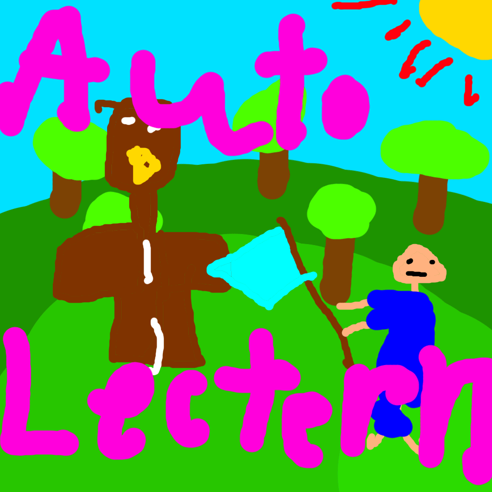

# Auto Lectern (Fabric):
</img> 
This mod basically breaks and places lecterns to cycle trades for you.
## Usage:
Add a goal: 
`/autolec add [enchant]? [(minLevel, maxLevel)/min/max/any] [(minPrice, maxPrice)/min/max/any]` 
Look at a lectern 
`/autolec start` 
Stop: 
`/autolec stop` 
If there isn't any goal Auto Lectern will cycle forever. 
If you wish to make Auto Lectern wait for the lectern item to be picked up first,
do  
`/autolec sync item` 